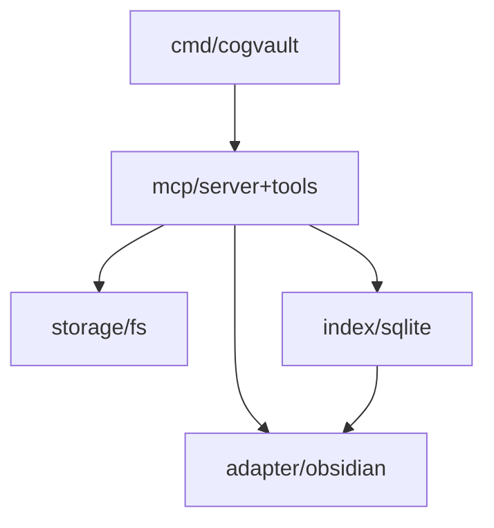

# cogvault

MCP tool server for building LLM-curated wikis in Obsidian vaults.

**Status:** MVP in progress — Step 1/9 complete

## MVP capabilities (planned)

- **6 MCP tools** — read, write, list, search, scan, parse
- **Passthrough mode** — agent orchestrates, engine provides tools only
- **Hybrid Obsidian integration** — wiki lives inside the vault in `_wiki/`
- **SQLite FTS5 full-text search** — trigram tokenizer, CJK-friendly
- **Path security** — traversal prevention, exclude patterns, `_schema.md` write protection
- **Single binary** — pure Go, no CGo

### Current state

Step 1 complete: sentinel error types (`internal/errors`) and YAML config loading with strict validation (`internal/config`).

## Planned CLI

These commands will be available after Step 6.

```text
go build -o cogvault ./cmd/cogvault
cogvault init --vault ~/my-vault
cogvault serve
```

## Target architecture



## Development

Requires Go 1.26.1+.

```bash
go test -race ./...
```

### Roadmap

- [x] Step 1: errors + config
- [ ] Step 2: storage (interface + fs + security tests)
- [ ] Step 3: adapter (interface + obsidian scanner/parser)
- [ ] Step 4: index (interface + sqlite + consistency)
- [ ] Step 5: mcp (server + tools + round-trip tests)
- [ ] Step 6: cmd (cobra: init/search/serve)
- [ ] Step 7: schema (default_schema.md + go:embed)
- [ ] Step 8: integration tests
- [ ] Step 9: 1-week real-world validation

## Project docs

- [SPEC.md](SPEC.md) — MVP specification (behavior contract)
- [DESIGN.md](DESIGN.md) — Architecture and component design
- [CLAUDE.md](CLAUDE.md) — Decision context and background
- [docs/decisions/](docs/decisions/) — Architectural decision records

## License

[MIT](LICENSE)
