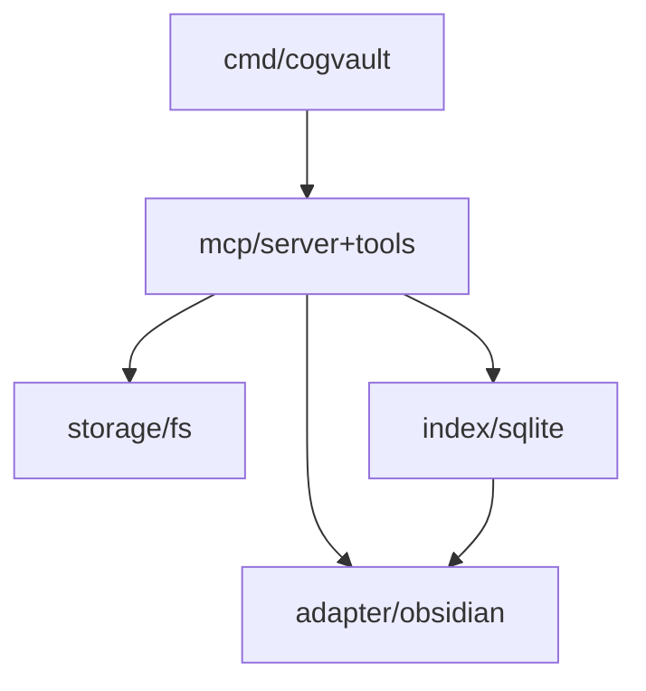

# cogvault

MCP tool server for building LLM-curated wikis in Obsidian vaults.

**Status:** MVP in progress — Step 7/9 complete

## MVP capabilities (planned)

- **6 MCP tools** — read, write, list, search, scan, parse
- **Passthrough mode** — agent orchestrates, engine provides tools only
- **Hybrid Obsidian integration** — wiki lives inside the vault in `_wiki/`
- **SQLite FTS5 full-text search** — trigram tokenizer, CJK-friendly
- **Path security** — traversal prevention, exclude patterns, `_schema.md` write protection
- **Single binary** — pure Go, no CGo

### Current state

Steps 1–7 complete: sentinel error types (`internal/errors`), YAML config loading with strict validation (`internal/config`), storage interface with fs security (`internal/storage`), adapter interface with obsidian/markdown parsers (`internal/adapter`), index interface with SQLite FTS5 + consistency (`internal/index`), MCP server with 6 tools (`internal/mcp`), Cobra CLI (`cmd/cogvault`), and embedded default schema via `go:embed` (`internal/schema`).

## CLI

```text
go build -o cogvault ./cmd/cogvault
cogvault init --vault ~/my-vault
cogvault search --vault ~/my-vault "query"
cogvault serve --vault ~/my-vault
```

## Target architecture



## Development

Requires Go 1.26.1+.

```bash
go test -race ./...
```

### Roadmap

- [x] Step 1: errors + config
- [x] Step 2: storage (interface + fs + security tests)
- [x] Step 3: adapter (interface + obsidian scanner/parser)
- [x] Step 4: index (interface + sqlite + consistency)
- [x] Step 5: mcp (server + tools + round-trip tests)
- [x] Step 6: cmd (cobra: init/search/serve)
- [x] Step 7: schema (default_schema.md + go:embed)
- [ ] Step 8: integration tests
- [ ] Step 9: 1-week real-world validation

### v0.2+ candidate ideas

- [ ] Taxonomy/status tools: add a lightweight `wiki_status` or `wiki_taxonomy` view so agents can inspect the vault structure before broad search.
- [ ] Duplicate-aware write workflow: add a pre-write duplicate/similarity check to reduce parallel pages with overlapping meaning.
- [ ] Wake-up summary: generate a small always-loadable vault summary separate from `_schema.md` for low-token agent bootstrapping.
- [ ] Stronger wiki navigation model: formalize `_wiki/` subtrees as a first-class browsing taxonomy rather than relying only on path conventions.

Out of scope for MVP and not planned as direct adoptions:

- AAAK-style custom compression dialect
- vector/semantic search as a standalone replacement for SQLite FTS (hybrid complement planned for v0.3+)
- temporal knowledge graph as a required core abstraction
- conversation-mining as a primary product mode

## Project docs

- [SPEC.md](SPEC.md) — MVP specification (behavior contract)
- [DESIGN.md](DESIGN.md) — Architecture and component design
- [CLAUDE.md](CLAUDE.md) — Decision context and background
- [docs/decisions/](docs/decisions/) — Architectural decision records

## License

[MIT](LICENSE)
